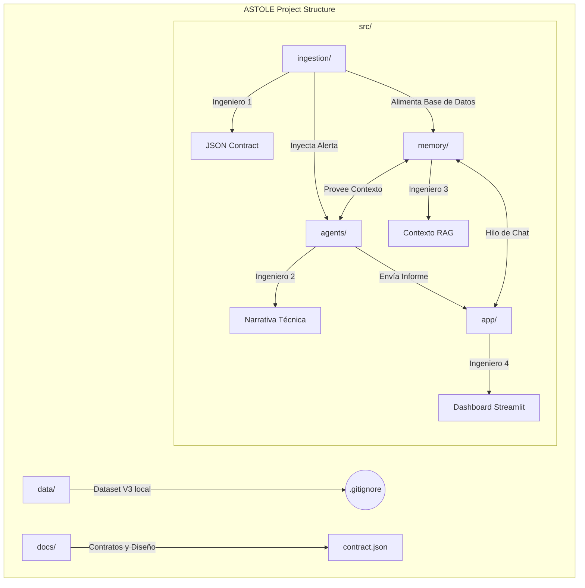

# ASTOLE: Narrative Intelligence for Infrastructure Critical
Proyecto para la asignatura PAE - 2026.

# ASTOLE: Narrative Intelligence for Infrastructure Critical
Proyecto para la asignatura PAE - 2026.

## Equipo
- Ingeniero 1: Data & Ingestion
- Ingeniero 2: AI Core & Agents
- Ingeniero 3: RAG & Memory
- Ingeniero 4: UI & Telemetry

## Estructura (diagrama)

## Áreas y responsabilidades

### Área 1: Ingestión (Ingeniero 1)
- **Input:** Dataset crudo NF-UNSW-NB15-v3 (CSV/Parquet).
- **Proceso:** Filtrado de ataques y agrupación en ventanas de 60 segundos.
- **Output:**
  1. **JSON Alert:** Un paquete con la anomalía detectada para activar al Router.
  2. **Bulk Logs:** Envío masivo de la ventana de 60s para almacenamiento.

### Área 2: Core de IA / Agentes (Ingeniero 2)
- **Input:** JSON Alert (del Ing. 1) + Contexto RAG (del Ing. 3).
- **Proceso:** Clasificación mediante el Router y redacción de la narrativa mediante Skills especializados.
- **Output:** Narrativa Estructurada. Un texto jerárquico (Resumen -> Detalles -> Acción recomendada) listo para el Dashboard.

### Área 3: Memoria y RAG (Ingeniero 3)
- **Input:** Bulk Logs (del Ing. 1) + Consulta semántica (del Ing. 2 o Ing. 4).
- **Proceso:** Indexación en ChromaDB y búsqueda de similitud.
- **Output:**
  1. **Context Snippets:** Fragmentos de logs pasados para enriquecer la alerta.
  2. **Chat Response:** Respuesta del modelo Llama 3 local para la investigación activa.

### Área 4: UI y Telemetría (Ingeniero 4)
- **Input:** Narrativa Estructurada (del Ing. 2) + Respuesta de Chat (del Ing. 3).
- **Proceso:** Visualización en Streamlit y cálculo de consumo de tokens/costes.
- **Output:** Dashboard Operativo. Interfaz final para Jordi con métricas de eficiencia.

