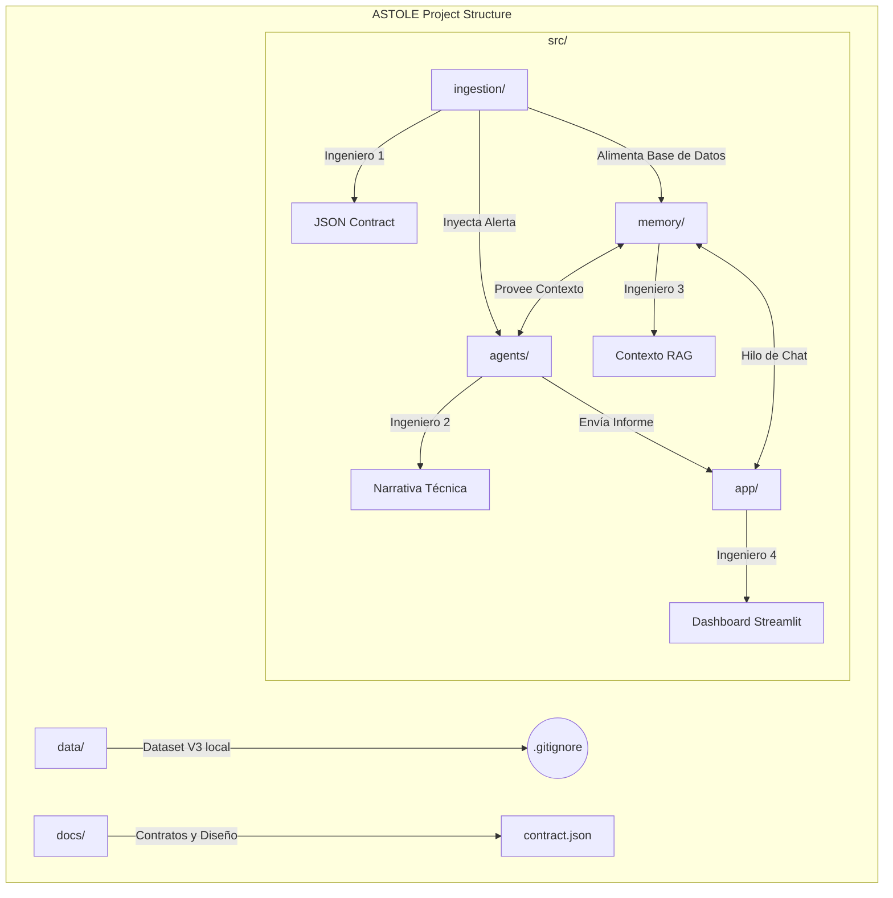

# ASTOLE: Narrative Intelligence for Infrastructure Critical
Proyecto para la asignatura PAE - 2026.

# ASTOLE: Narrative Intelligence for Infrastructure Critical
Proyecto para la asignatura PAE - 2026.

## Equipo
- Ingeniero 1: Data & Ingestion
- Ingeniero 2: AI Core & Agents
- Ingeniero 3: RAG & Memory
- Ingeniero 4: UI & Telemetry

## Estructura (diagrama)



## Áreas y responsabilidades

### Área 1: Ingestión (Ingeniero 1)
- **Input:** Dataset crudo NF-UNSW-NB15-v3 (CSV/Parquet).
- **Proceso:** Filtrado de ataques y agrupación en ventanas de 60 segundos.
- **Output:**
  1. **JSON Alert:** Un paquete con la anomalía detectada para activar al Router.
  2. **Bulk Logs:** Envío masivo de la ventana de 60s para almacenamiento.

### Área 2: Core de IA / Agentes (Ingeniero 2)
- **Input:** JSON Alert (del Ing. 1) + Contexto RAG (del Ing. 3).
- **Proceso:** Clasificación mediante el Router y redacción de la narrativa mediante Skills especializados.
- **Output:** Narrativa Estructurada. Un texto jerárquico (Resumen -> Detalles -> Acción recomendada) listo para el Dashboard.

### Área 3: Memoria y RAG (Ingeniero 3)
- **Input:** Bulk Logs (del Ing. 1) + Consulta semántica (del Ing. 2 o Ing. 4).
- **Proceso:** Indexación en ChromaDB y búsqueda de similitud.
- **Output:**
  1. **Context Snippets:** Fragmentos de logs pasados para enriquecer la alerta.
  2. **Chat Response:** Respuesta del modelo Llama 3 local para la investigación activa.

### Área 4: UI y Telemetría (Ingeniero 4)
- **Input:** Narrativa Estructurada (del Ing. 2) + Respuesta de Chat (del Ing. 3).
- **Proceso:** Visualización en Streamlit y cálculo de consumo de tokens/costes.
- **Output:** Dashboard Operativo. Interfaz final para el analista con métricas de eficiencia.


## 🛠️ Instalación y Configuración

Todos los miembros del equipo deben seguir estos pasos para asegurar la compatibilidad:

### 1. **Clonar el repositorio:**
   ```bash
   git clone https://github.com/RogerCL24/ASTOLE_Project.git
   cd ASTOLE_Project
   ```

### 2. **Crear el entorno virtual**
    ```bash
    python3 -m venv venv
    source venv/bin/activate
    ```
### 3. **Instalar dependencias:**
    ```bash
    pip install --upgrade pip
    pip install -r requirements.txt
    ```

### 4. **Archivos no incluidos (Configuración manual)**

Debido a políticas de seguridad y tamaño de archivos, los siguientes elementos **no están en el repositorio** y deben ser gestionados localmente por cada ingeniero:

### 📁 Carpeta `data/`
- **Qué hacer:** Crea la carpeta `data/` en la raíz del proyecto.
- **Contenido:** Descarga el dataset **NF-UNSW-NB15-v3** desde el enlace compartido en el grupo y colócalo aquí. 
- **Nota:** El Ingeniero 1 (Data) notificará si se requiere una versión específica (.csv o .parquet).

### 🔑 Archivo `.env`
- **Qué hacer:** Crea un archivo llamado `.env` en la raíz del proyecto.
- **Contenido:** Define las variables de entorno necesarias para los agentes y APIs:
  ```env
  OPENAI_API_KEY=tu_clave_aqui
  # Si usas modelos locales vía Ollama, asegúrate de que el servicio esté corriendo.
  ```


