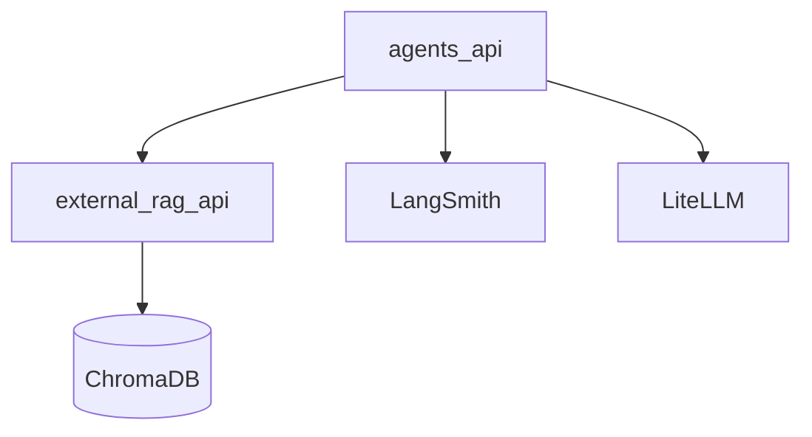
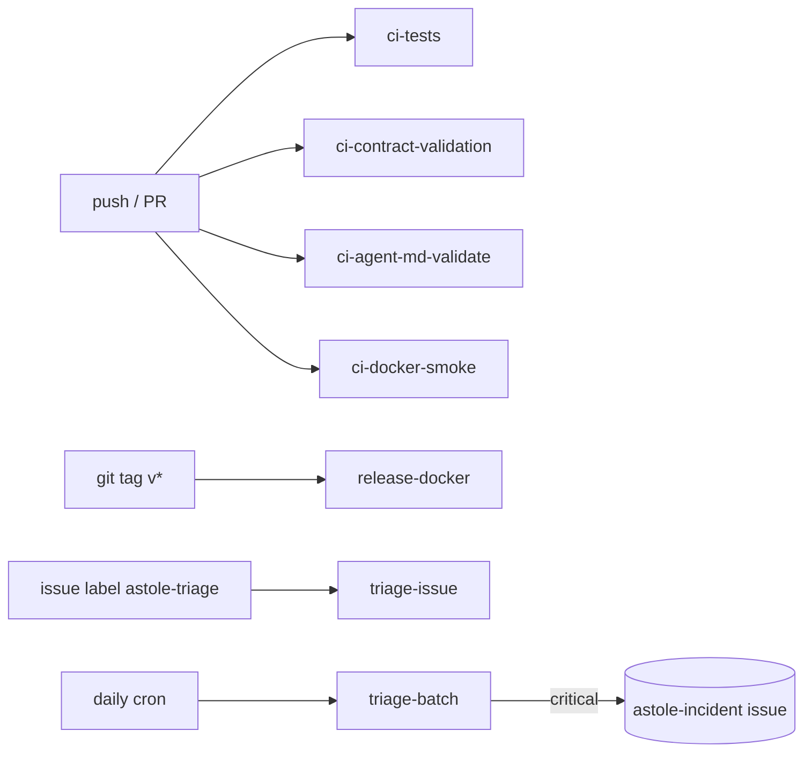

# ASTOLE Agents Architecture

This document describes the production architecture for Engineer 2 (LangGraph
agent layer), with docker-first deployment and integration with external layers.

## End-to-end Flow

```mermaid
flowchart LR
  inputAlert[InputAlert v1_1] --> routerNode[router_node]
  routerNode --> skillNode[skill_node]
  skillNode --> ragNode[rag_enrichment_node]
  ragNode --> summarizerNode[summarizer_node]
  summarizerNode --> triageOutput[TriageOutput]
  triageOutput --> fastapiEndpoint[/triage]
```

## Runtime Components

- `router_node`: hybrid routing (rule-based first, LLM fallback only when needed)
- `skill_node`: specialized threat assessment for attack families
- `rag_enrichment_node`: external context retrieval from RAG API (`/query`)
- `summarizer_node`: hierarchical narrative generation (`executive`, `tactical`, `impact`)
- `FastAPI /triage`: validated JSON contract for downstream dashboard
- `src/agents/cli.py`: operational CLI for docker lifecycle, health and smoke triage

## Dockerized deployment boundary

Layer 1 is designed to run fully dockerized as:

- `agents-api`
- `rag-api`
- `chromadb`

This allows reliable integration with the rest of ASTOLE through stable HTTP
contracts and deterministic startup commands.

## Service Integration



## Contracts

- Input canonical format: `docs/specs/CONTRACT.md` v1.1 (`label_multiclase`, `binary_attack`)
- Backward compatibility: legacy input aliases are accepted and normalized
- Output format: `TriageOutput` from `src/agents/models/output_schemas.py`

## Skills Implemented

- `dos_fuzzers`
- `exploits_backdoor`
- `recon_analysis`
- `shellcode_worms`
- `generic`
- `benign_guard`

## Token/Cost Strategy

- Router: low token budget, rules preferred over LLM
- Skills: tiered token budgets (`fast`, `standard`, `deep`)
- Summarizer: compact hierarchical output
- Tracing: optional LangSmith for per-node observability

## LangSmith and LangChain Usage

- **LangChain/LangGraph orchestration** is applied in:
  - `src/agents/graph/workflow.py` (graph definition and node wiring)
  - `src/agents/graph/rag_node.py` (explicit external RAG stage)
- **LangSmith tracing hooks** are applied in:
  - `src/agents/core/config.py` (`LANGSMITH_*` settings and env wiring)
  - `src/agents/main.py` (runtime startup path through `setup_litellm`)

When `LANGSMITH_TRACING=true`, runtime exports `LANGCHAIN_TRACING_V2`,
`LANGCHAIN_API_KEY`, `LANGCHAIN_ENDPOINT` and `LANGCHAIN_PROJECT`.

## Pipeline architecture

ASTOLE implements a hub-and-spoke + planner-executor pattern for
real-time alert triage:

- **L0/L1/L2 hierarchy** — declared in `AGENTS.md` and `*.agent.md` files.
- **Mandatory 4-stage pipeline** — Router → Skill → RAG → Summarizer, no
  stage skippable; each stage tags its output as `OK` / `PLAN_VACIO` / `ERROR`.
- **Structured 5-block handoffs** — `task`, `scope`, `accumulated_context`,
  `constraints`, `attention_points` — implemented in
  `src/agents/core/handoffs.py` and traced in `AgentState["handoffs"]`.
- **Circuit breakers** — per-stage post-action invariants in
  `src/agents/core/circuit_breaker.py`.
- **Markdown-defined agents and skills** — every agent has a `*.agent.md`,
  every skill has a `*.skill.md`, validated by CI.
- **Parallel execution** — the skill assessment, RAG pre-fetch and
  external-intelligence calls run concurrently inside each skill super-step
  (see `docs/PIPELINE_DESIGN.md`).

See [`docs/PIPELINE_DESIGN.md`](docs/PIPELINE_DESIGN.md) for the full design rationale.

## GitHub Runners (CI/CD + Issue-driven triage)



See [`docs/CI_PIPELINE.md`](docs/CI_PIPELINE.md) and
[`docs/ISSUE_DRIVEN_TRIAGE.md`](docs/ISSUE_DRIVEN_TRIAGE.md).

## Full docs

For complete operational and integration documentation, see:

- `AGENTS.md` (top-level hierarchy)
- `src/agents/README.md`
- `src/agents/docs/PIPELINE_DESIGN.md`
- `src/agents/docs/HANDOFFS.md`
- `src/agents/docs/CI_PIPELINE.md`
- `src/agents/docs/ISSUE_DRIVEN_TRIAGE.md`
- `src/agents/docs/DOCKER_DEPLOYMENT.md`
- `src/agents/docs/OPERATIONS.md`
- `src/agents/docs/CONTRACTS_AND_API.md`
- `src/agents/docs/SKILLS_AND_PROMPTS.md`
- `src/agents/docs/OBSERVABILITY.md`
- `src/agents/agents/skills/README.md`
