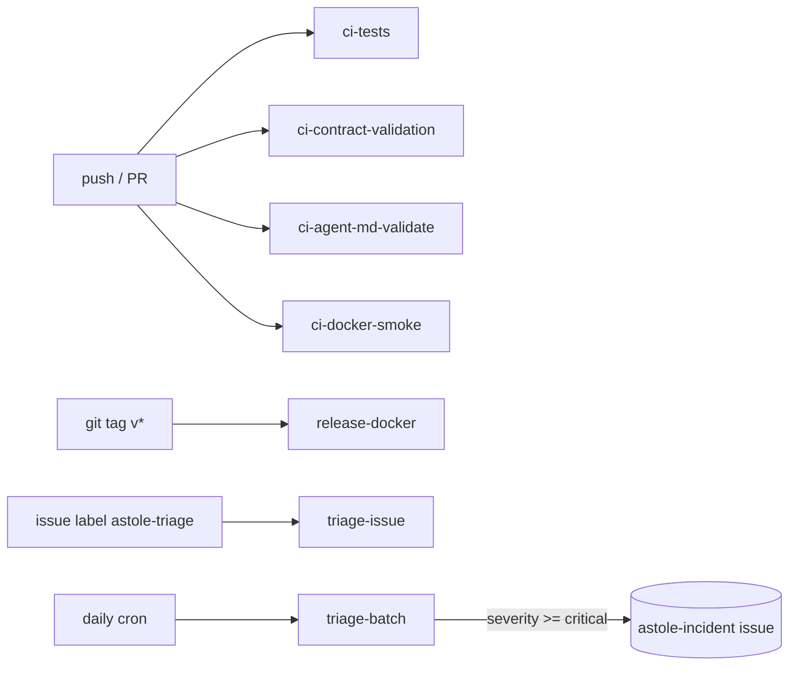

# CI Pipeline — GitHub Runners Topology

ASTOLE uses GitHub Actions as its runner platform. The mandatory QA pipeline
(tests + lint + contract validation + docker smoke + agent-md validation)
runs on every push and pull request.

## Runner catalogue

| Workflow | Trigger | Purpose |
| --- | --- | --- |
| [`ci-tests.yml`](../../../.github/workflows/ci-tests.yml) | push, PR, manual | `pytest` + ruff lint + (soft) mypy |
| [`ci-contract-validation.yml`](../../../.github/workflows/ci-contract-validation.yml) | PR on contract paths | Validates sample payloads against `InputAlert` schema, validates `Handoff` schema |
| [`ci-docker-smoke.yml`](../../../.github/workflows/ci-docker-smoke.yml) | push/PR on Docker paths | Build + up + health + `/triage` smoke |
| [`ci-agent-md-validate.yml`](../../../.github/workflows/ci-agent-md-validate.yml) | push/PR on `.agent.md` / `*.skill.md` | Validates YAML frontmatter |
| [`release-docker.yml`](../../../.github/workflows/release-docker.yml) | tag `v*.*.*` or manual | Publishes images to GHCR (`agents-api`, `rag-api`) |
| [`triage-issue.yml`](../../../.github/workflows/triage-issue.yml) | issue label `astole-triage` or manual | Runs the pipeline against an issue payload, posts result |
| [`triage-batch.yml`](../../../.github/workflows/triage-batch.yml) | daily cron + manual | Replays curated alerts, auto-opens incident issues |

## Required checks (recommended branch-protection)

For `main`:

- `ci-tests`
- `ci-contract-validation`
- `ci-agent-md-validate`
- `ci-docker-smoke`

For `feature/**` PRs only the first three are recommended.

## Diagram



## Secrets / variables expected

| Name | Used by | Notes |
| --- | --- | --- |
| `GITHUB_TOKEN` | all workflows | Auto-provided by Actions |
| `OPENAI_API_KEY` | `triage-issue`, `triage-batch` | Optional — workflows fall back to mocked LiteLLM if unset |
| `LANGSMITH_API_KEY` | optional everywhere | Activates `LANGSMITH_TRACING=true` end-to-end |

## Local dry-run

Replicate any runner locally with:

```bash
# Tests
PYTHONPATH=. RAG_USE_MOCK=true CACHE_ENABLED=false pytest src/agents/tests -q

# Docker smoke
docker compose up --build -d
curl -fsS http://localhost:8010/health
curl -fsS -X POST http://localhost:8010/triage \
  -H "Content-Type: application/json" \
  -d @docs/samples/sample_alert.json
docker compose down -v
```
