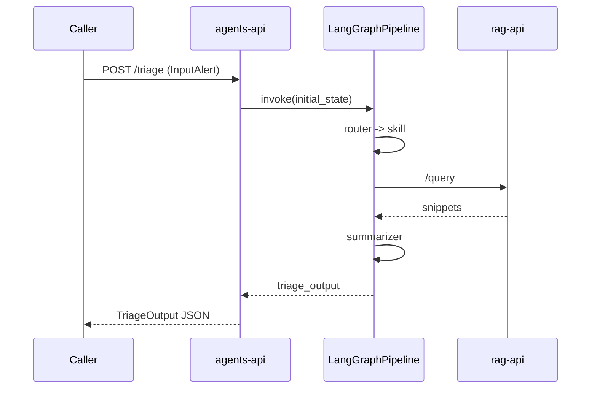

# Contracts and API

This document defines the Layer 1 API and schema compatibility commitments.

## Input contract (canonical)

Canonical v1.1 fields from `docs/specs/CONTRACT.md`:

- `gnn_metadata.label_multiclase`
- `gnn_metadata.binary_attack`

Layer 1 also accepts legacy aliases:

- `label_multiclass`
- `label_binary`

Additional compatibility behavior:

- `technical_details` metrics are merged into `network_data` automatically.

## Output contract

`TriageOutput` includes:

- `assessment` (structured skill assessment)
- `narrative` (`executive`, `tactical`, `impact`)
- `context_used` (RAG usage summary)
- `metadata` (latency/tokens/cost/models/cache)

## Endpoints

- `POST /triage`: single alert triage
- `POST /triage/batch`: multiple alerts (up to 50)
- `GET /health`: service readiness
- `GET /metrics`: accumulated token/cost metrics

## Request/response flow

## Integration guidance for Engineer 4

- Send payloads in canonical v1.1 format when possible.
- Use `/triage` for real-time panels and `/triage/batch` for window processing.
- Parse `narrative.executive` for high-level display and `narrative.tactical` for analyst detail.
