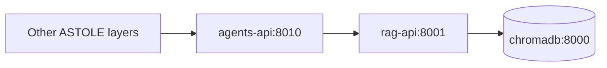

# Docker Deployment Guide - ASTOLE Agents

This guide explains how to run Layer 1 fully dockerized and integrated with the
rest of the ASTOLE stack.

## Services

Layer 1 uses these docker-compose services from repository root:

- `agents-api`: LangGraph + FastAPI triage service
- `rag-api`: adapter service exposing external RAG contract (`/query`)
- `chromadb`: persistent vector store used by `rag-api`

## Topology



## Start

```bash
docker compose up --build -d
```

## Stop

```bash
docker compose down
```

## Verify

```bash
python -m src.agents.cli --api-url http://localhost:8010 health
```

Expected:

- `GET /health` on `agents-api` returns `200`
- `GET /health` on `rag-api` returns `200`

## Ports

- Host `8010` -> container `agents-api:8000`
- Host `8001` -> container `rag-api:8001`
- Host `8002` -> container `chromadb:8000`

## Required environment variables

Use root `.env` (see `.env.example`):

- `OPENAI_API_KEY` and/or `ANTHROPIC_API_KEY`
- `RAG_API_URL=http://rag-api:8001` (inside docker network)
- Optional tracing:
  - `LANGSMITH_TRACING=true`
  - `LANGSMITH_API_KEY`
  - `LANGSMITH_PROJECT`

## Common startup issues

- Docker daemon unavailable: start Docker Desktop first.
- API key missing: skills/summarizer can fallback, but output quality drops.
- First run slower: sentence-transformer model download for RAG.
