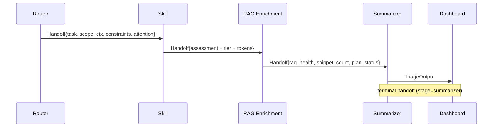

# Handoffs — Structured Inter-Agent Communication

Every pipeline stage emits a **5-block handoff** stored in `AgentState["handoffs"]`.

## Schema

| Block | Purpose |
| --- | --- |
| `task` | Precise instruction for the receiver |
| `scope` | Fields / records the receiver may touch |
| `accumulated_context` | Concrete data from previous stages |
| `constraints` | What the receiver must NOT do (existence-validation reminder is mandatory) |
| `attention_points` | Risks, dependencies, pending decisions |

Plus two metadata fields:

| Field | Purpose |
| --- | --- |
| `plan_status` | `OK` / `PLAN_VACIO` / `ERROR` |
| `reason` | Justification when `plan_status != OK` |

## Plan vs Error semantics

| `plan_status` | Meaning | Pipeline action |
| --- | --- | --- |
| `OK` | Stage produced its expected artifact | Continue |
| `PLAN_VACIO` | No work needed in this stage (justified) | Continue, downstream may degrade |
| `ERROR` | Work needed but blocked | Pipeline degrades, summarizer flags |

## Example handoffs

### Router → Skill

```json
{
  "stage": "router",
  "from_agent": "router",
  "to_agent": "exploits_backdoor",
  "task": "Run threat assessment using skill 'exploits_backdoor'.",
  "scope": ["alert_id", "network_data", "gnn_metadata", "top_features"],
  "accumulated_context": {
    "label_multiclase": "Exploits",
    "confidence_score": 0.87,
    "confidence_tier": "standard",
    "binary_attack": 1
  },
  "constraints": [
    "Validate cache / prior-assessment existence before re-computing.",
    "Respect token budget for the chosen tier.",
    "Return strict JSON SkillAssessment only."
  ],
  "attention_points": [
    "Bias toward true-positive when label is critical-class.",
    "Worms / Shellcode require immediate-containment recommendations."
  ],
  "plan_status": "OK",
  "reason": null
}
```

### RAG → Summarizer (PLAN_VACIO example)

```json
{
  "stage": "rag_enrichment",
  "from_agent": "rag_enrichment",
  "to_agent": "summarizer",
  "task": "Synthesize executive/tactical/impact narrative.",
  "scope": ["assessment", "rag_context", "input"],
  "accumulated_context": {
    "rag_snippets_count": 0,
    "rag_health": "empty",
    "rag_query": "Correlate Exploits indicators for source ..."
  },
  "constraints": [
    "Validate cache / prior-assessment existence before re-computing.",
    "Do not invent IOCs — use only what exists in assessment + rag_context.",
    "Strict JSON narrative output."
  ],
  "attention_points": [
    "Empty context is allowed — handle gracefully.",
    "Note RAG-degraded mode in the impact section if applicable."
  ],
  "plan_status": "PLAN_VACIO",
  "reason": "No historical context matched the alert query."
}
```

## Diagram



## Programmatic access

```python
from src.agents.core.handoffs import Handoff, PlanStatus, append_handoff, make_handoff

handoff = make_handoff(
    stage="router",
    from_agent="router",
    to_agent="dos_fuzzers",
    task="...",
    scope=["..."],
    accumulated_context={"...": "..."},
    constraints=["..."],
    attention_points=["..."],
    plan_status=PlanStatus.OK,
)
append_handoff(state, handoff)
```

The helper `make_handoff` automatically inserts the existence-validation
constraint when missing.

## Circuit breakers

After each stage, `src/agents/core/circuit_breaker.py` runs invariant checks
and records violations in `state["circuit_violations"]`. The CI workflow
`ci-tests.yml` exercises these invariants on every PR.
