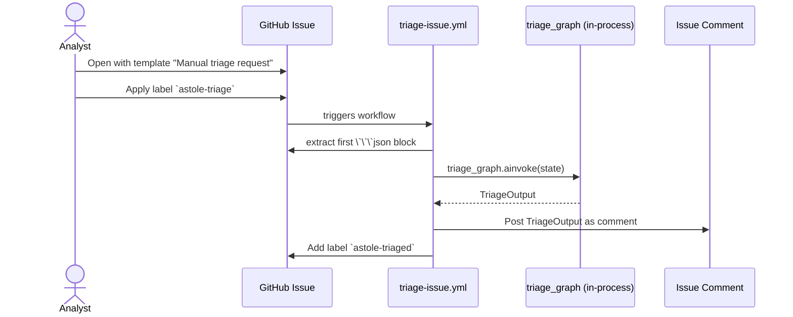
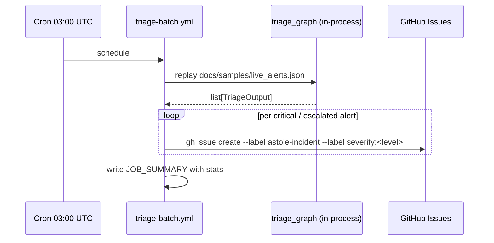

# Issue-Driven Triage

ASTOLE supports running the full triage pipeline **directly from a GitHub
issue** (issue → analysis → PR/comment).

There are two flows: **manual** (analyst opens an issue with a payload) and
**automatic** (batch runner detects critical alerts and opens issues).

## Manual flow



## Automatic flow



## Manual triage example

1. Analyst opens an issue using the **Manual triage request** template:

   ```markdown
   ## Alert payload (canonical InputAlert v1.1)

   ```json
   {
     "alert_id": "AST-MANUAL-001",
     "timestamp": "2026-04-09T10:00:00Z",
     "gnn_metadata": {
       "label_multiclase": "Exploits",
       "binary_attack": 1,
       "confidence_score": 0.91
     },
     "network_data": { ... },
     "technical_details": { ... }
   }
   ```
   ```

2. Analyst adds the `astole-triage` label.

3. The `triage-issue.yml` runner extracts the first `json` code block, runs
   the pipeline, and posts the TriageOutput as a comment, then labels the
   issue `astole-triaged` (or `astole-triage-failed`).

## Auto-incident example

When `triage-batch.yml` detects a TriageOutput with `severity` ≥ threshold
(default `critical`) or `is_escalated=true`, it opens an issue:

```
[ASTOLE][CRITICAL] Auto-triage incident AST-V3-1424242192557

**Triage ID:** TRG-XXXXXXXX
**Severity:** critical
**Skills activated:** exploits_backdoor

### Executive
…

### Tactical
…

### Recommended actions
- block source IP …
- isolate host …

<details><summary>Full TriageOutput</summary>
…
</details>
```

with labels `astole-incident` and `severity:critical`.

## Why this is useful

- **Reproducibility.** Every triage run is permanently associated with an
  issue, including the input payload, the model versions used, and the
  escalation decision.
- **SOC integration.** SOC analysts already live on GitHub Issues for ticket
  tracking; ASTOLE plugs into that workflow without requiring a new tool.
- **Audit trail.** The pipeline trace (handoffs, plan_status, circuit
  violations) is part of the issue thread and survives indefinitely.
- **Cost discipline.** Issue-driven triage runs use the same mocked LLM mode
  as CI by default, keeping token cost zero unless `OPENAI_API_KEY` is set.
