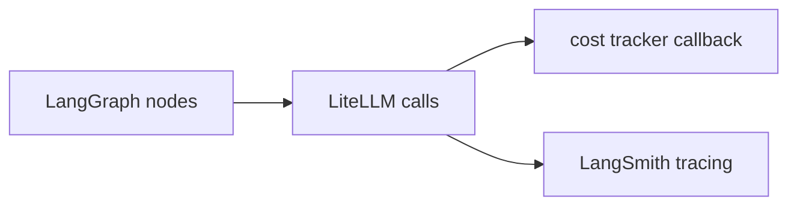

# Observability, Cost, and Tracing

Layer 1 includes lightweight cost tracking and optional LangSmith tracing.

## What is measured

- Processing time (ms)
- Token usage by node (`router`, `skill`, `summarizer`, `total`)
- Estimated request cost (`cost_usd`)
- Models used per request
- Cache hit status

These fields are exposed in `TriageOutput.metadata`.

## Tracing stack

## LangSmith activation

Set environment variables:

- `LANGSMITH_TRACING=true`
- `LANGSMITH_API_KEY=<key>`
- `LANGSMITH_PROJECT=astole-triage`
- optional: `LANGSMITH_ENDPOINT`

At startup, `setup_litellm()` propagates:

- `LANGCHAIN_TRACING_V2`
- `LANGCHAIN_API_KEY`
- `LANGCHAIN_ENDPOINT`
- `LANGCHAIN_PROJECT`

## Operational recommendations

- Use LangSmith in staging/production to analyze fallback frequency and latency.
- Alert on sustained growth of `tokens_used.total` per alert.
- Alert on spikes of `errors` list population in graph state.
