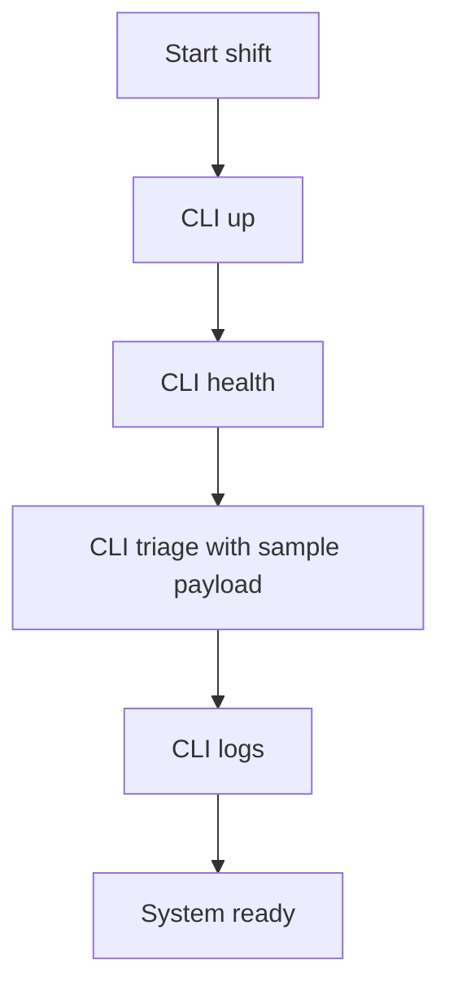

# Runtime and CLI Operations

This document describes day-to-day operation of Layer 1.

## CLI entrypoint

`src/agents/cli.py` provides operational commands:

- `up`: starts docker stack (`docker compose up --build -d`)
- `down`: stops docker stack
- `logs`: tails compose logs
- `health`: checks `agents-api` and `rag-api`
- `triage`: sends one payload to `/triage`

## Typical runbook



Commands:

```bash
python -m src.agents.cli up
python -m src.agents.cli --api-url http://localhost:8010 health
python -m src.agents.cli --api-url http://localhost:8010 triage --payload docs/samples/live_alerts.json
python -m src.agents.cli logs --service agents-api --tail 200
```

## Non-docker local fallback

If Docker daemon is not available:

1. Start RAG API:
   - `uvicorn src.memory.rag_api:app --host 0.0.0.0 --port 8001`
2. Start Agents API:
   - `RAG_API_URL=http://localhost:8001 uvicorn src.agents.main:app --host 0.0.0.0 --port 8010`
3. Use CLI `health` and `triage`.

## Operational KPIs

- Latency per `/triage` request (`metadata.processing_time_ms`)
- Token usage (`metadata.tokens_used`)
- Cost (`metadata.cost_usd`)
- Error rate (HTTP 5xx and fallback frequency)

## Incident hints

- Repeated fallback to `generic` skill: inspect model credentials and router logs.
- `Context unavailable`: inspect `rag-api` and Chroma availability.
- High latency spikes: inspect model provider latency and RAG timeout settings.
