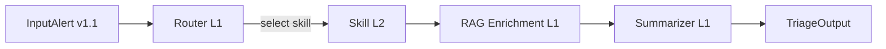
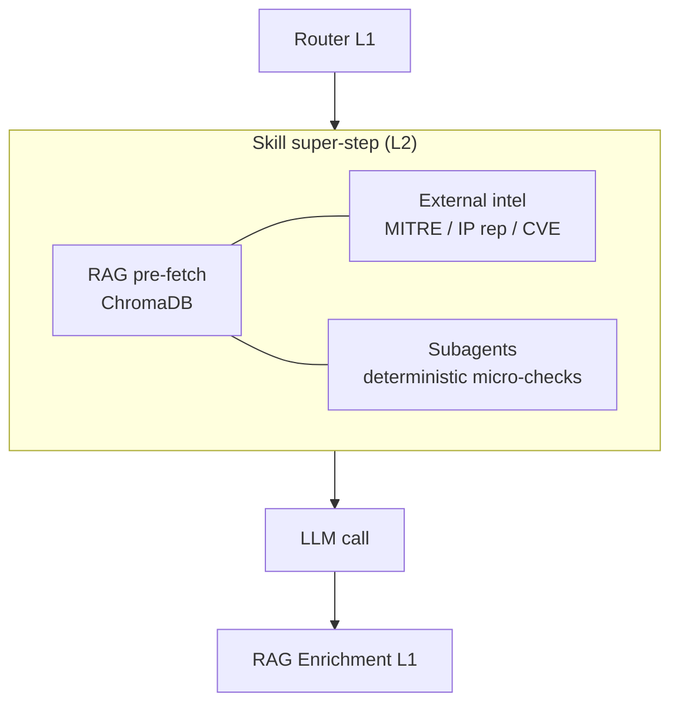

# Pipeline Design — Sequential vs Parallel Execution

This document explains **what runs sequentially** and **what runs in parallel**
inside the ASTOLE triage pipeline, and why.

## Hierarchy recap

```
L0  triage_graph         (orchestrator, compiled LangGraph)
└── L1  router            (planner / classifier, picks the skill)
    L1  rag_enrichment    (external organisational-context coordinator)
    L1  summarizer        (CISO-level narrative builder)
    L2  skills/*          (specialist analysts, picked by the router)
        L2  subagents/*   (deterministic micro-checks per skill)
        L2  external_intel (MITRE / IP reputation / CVE — MCP-style tools)
        L2  rag_pre_fetch  (ChromaDB pre-fetch)
```

## Mandatory pipeline (sequential at L0)



The **L0 pipeline is strictly sequential**: each stage produces evidence the
next stage consumes. No stage is skippable. This guarantees the canonical
`TriageOutput` contract is always built from a complete chain of handoffs.

## Parallelism within the skill super-step (L2)

When the router selects a skill, the skill node enters a **super-step** that
fan-outs three independent jobs and collects their results before invoking
the LLM exactly once:



Implementation: `src/agents/agents/skills/base_skill.py::run_skill` uses a
single `asyncio.gather` for all three jobs. Latency is `max(rag, intel,
subagents)` instead of `sum(...)`.

## Parallel vs sequential — per attack case

| Multiclass label | Skill | Subagents (parallel) | RAG mandatory? | External intel mandatory? | Notes |
| --- | --- | --- | --- | --- | --- |
| Benign | `benign_guard` | — | no | no | Rule-based short-circuit, **fully sequential, no LLM call** |
| Generic | `generic` | entropy_check, tls_fingerprint_check, correlation_check | yes | optional | Catch-all, RAG dominant |
| DoS | `dos_fuzzers` | volumetric_check, tcp_flag_check, historical_check | yes | MITRE | Volumetric checks parallel; LLM corroborates |
| Fuzzers | `dos_fuzzers` | volumetric_check, tcp_flag_check, historical_check | yes | MITRE | Same skill as DoS |
| Reconnaissance | `recon_analysis` | port_scan_detector, web_probe_detector, scanner_allowlist_check | yes | IP reputation | Allowlist check downweights findings |
| Analysis | `recon_analysis` | port_scan_detector, web_probe_detector, scanner_allowlist_check | yes | IP reputation | Same skill as Reconnaissance |
| Exploits | `exploits_backdoor` | port_signature_check, payload_pattern_check, c2_persistence_check | yes | CVE + IP reputation | Bias toward true-positive |
| Backdoor | `exploits_backdoor` | port_signature_check, payload_pattern_check, c2_persistence_check | yes | CVE + IP reputation | Long-lived flow indicates C2 |
| Shellcode | `shellcode_worms` | lateral_movement_check, payload_signature_check, outbreak_correlation | yes | CVE | Container immediately if confirmed |
| Worms | `shellcode_worms` | lateral_movement_check, payload_signature_check, outbreak_correlation | yes | CVE | Lateral fan-out is the killer signal |

### When does the pipeline run in **fast / standard / deep** tier?

| Confidence tier | Trigger condition | RAG `top_k` | LLM `max_tokens` | Subagents | External intel |
| --- | --- | --- | --- | --- | --- |
| `fast` | `gnn_metadata.confidence_score >= 0.95` and not critical class | 2 | 384 | yes | yes |
| `standard` (default) | otherwise | 5 | 768 | yes | yes |
| `deep` | label ∈ {Exploits, Backdoor, Shellcode, Worms} OR low confidence | 10 | 960 | yes | yes |

## When does the system fall back to sequential?

- **Benign flow**: `benign_guard` runs zero LLM calls. The super-step is skipped.
- **RAG outage**: the `rag_pre_fetch` job is replaced by an empty context but
  the rest of the super-step continues. The RAG enrichment stage tags its
  output as `PLAN_VACIO` so the summarizer documents the degraded mode.
- **External intel disabled**: when `ASTOLE_INTEL_URL` is not set, the
  offline catalogue is used (deterministic + zero network).

## Subagent contract

Each subagent is a deterministic pure function:

```python
def subagent_fn(alert: dict, intel: dict) -> SubagentResult:
    return SubagentResult(name=..., verdict="match"|"no_match", confidence=..., evidence=...)
```

- Subagents NEVER call the LLM. They are *features* the LLM consumes.
- A subagent failure is **non-fatal**: it is reported as
  `verdict="indeterminate"` and the skill continues.
- Subagent results land in `state["subagent_results"][skill_name]` for
  observability and prompt enrichment.

## External intelligence (MCP-style)

`src/agents/tools/external_intel.py` exposes an MCP-style client (`MCPClient`)
that wraps a future Model Context Protocol server. Until that server is
available, the offline curated catalogues are used:

| Tool | Offline source | Remote-first? |
| --- | --- | --- |
| `mitre_attack_lookup` | label → ATT&CK techniques | yes (when `ASTOLE_INTEL_URL` is set) |
| `ip_reputation_lookup` | deterministic SHA-1 hash → score | yes |
| `cve_lookup` | port → service hint → curated CVE list | yes |

Failures of the remote tool are non-fatal — the offline catalogue is the
ultimate fallback so a degraded MCP server cannot block triage.

## State keys touched by parallel branches

To avoid concurrent-write conflicts, each branch writes to a dedicated
namespace:

| Branch | State key |
| --- | --- |
| RAG pre-fetch | `state["rag_context"]`, `state["rag_snippets_count"]` |
| External intel | `state["intel"]` |
| Subagents | `state["subagent_results"][skill_name]` |
| Skill assessment | `state["assessment"]` |
| RAG enrichment | `state["rag_context"]` (appended), `state["rag_enrichment_status"]` |
| Summarizer | `state["triage_output"]` |

Handoffs are appended to `state["handoffs"]` in arrival order; the 5-block
schema makes ordering interpretable post-hoc.
