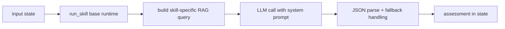

# Skills and Prompts

This document describes the specialized skill layer and prompt strategy.

## Skill map

- `Benign` -> `benign_guard`
- `DoS`, `Fuzzers` -> `dos_fuzzers`
- `Exploits`, `Backdoor` -> `exploits_backdoor`
- `Reconnaissance`, `Analysis` -> `recon_analysis`
- `Shellcode`, `Worms` -> `shellcode_worms`
- `Generic` -> `generic`

## Skill pipeline behavior

## Prompt package

Prompt files:

- `prompts/router.md`
- `prompts/dos_fuzzers.md`
- `prompts/exploits_backdoor.md`
- `prompts/recon_analysis.md`
- `prompts/shellcode_worms.md`
- `prompts/generic.md`
- `prompts/ciso_responder.md`

## Prompt quality principles

- Strict JSON-only outputs for reliable parsing
- Few-shot style guidance to reduce ambiguity
- Attack-family specific indicators and false-positive checks
- Explicit analyst actions in `recommended_actions`

## Token discipline

- `fast`: compact analysis budget
- `standard`: balanced depth
- `deep`: higher context and analysis budget

Target objective: keep average skill token usage below 800 in normal traffic.
